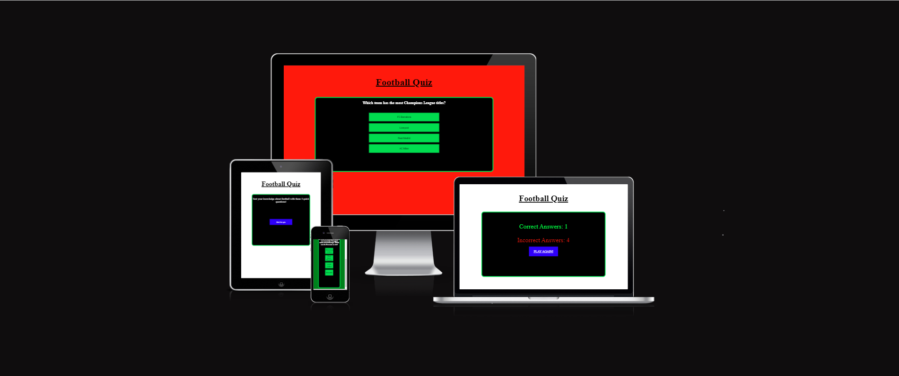
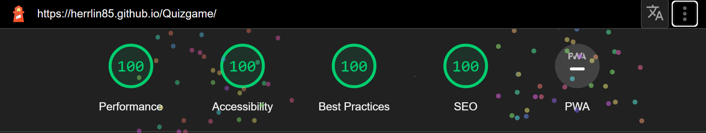

# Football quiz game
[Live link to Football Quiz](https://herrlin85.github.io/Quizgame/)

Football Quiz Game is a interactive quiz about the users knowledge in football. The quiz contains 10 questions about everything from individual players to teams across europe and even national teams.

## Testing

  - **Bugs**
    - No bugs found

  - **Manual testing**
     - I have tested and confirmes that the site is responsive in a range of devices and different screen sizes using Chromes devtools
     - I have tested and confirmes that the site works properly in browsers such as Chrome, Firefox and Microsoft Edge

**Validator Testing**
 - HTML
   - No errors were returned when passing through the official [W3C validator](https://validator.w3.org/nu/?doc=https%3A%2F%2Fherrlin85.github.io%2FQuizgame%2F)
  
  - CSS
    - No errors were returned when passing through the official [W3C validator](https://jigsaw.w3.org/css-validator/validator?uri=https%3A%2F%2Fherrlin85.github.io%2FQuizgame%2F&profile=css3svg&usermedium=all&warning=1&vextwarning=&lang=sv)

  - JavaScript 
    - No errors or bugs were returned when passing through [JSHint](https://jshint.com/)]

  - Accessibility 
   - I have checked and confirmed that the contrast on the site makes it easy to read and are accessible by using Lighthouse on Chrome

## Deployment

- The site was deployed to GitHub pages. The steps to deploy are as follows:
  - In the GitHub repository, navigate to the Settings tab
  - From the source section drop-down menu, select the Main Branch
  - Once the main branch has been selected, the page will be automatically refreshed with a detailed ribbon display to indicate the successful deployment.

  The live link can be found here https://herrlin85.github.io/Quizgame/

## Credits

**Content**

**Media**

No media was used