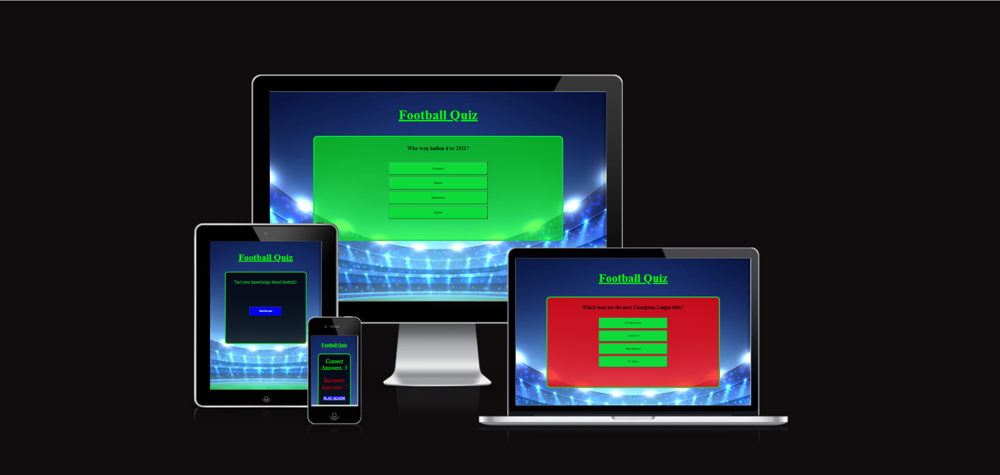

# Football quiz game
[Live link to Football Quiz](https://herrlin85.github.io/Quizgame/)

Football Quiz Game is a interactive quiz about the users knowledge in football. The quiz contains 10 questions about everything from individual players to teams across europe and even national teams.

## CONTENTS
* [Design](#Design)
  * [Colour Scheme](#Colour-Scheme)
  * [Images](#Images)
  * [Features](#Features)
  * [Accessibility](#Accessibility)
* [Future Implementations](#Future-Implementations)
  * [Sign up page](#Sign-up-page)
  * [Highscore](#Highscore)
  * [Categories](#Categories)
* [Testing](#Testing)
  * [Solved Bugs](#Solved-Bugs)
  * [Manual Testing](#Manual-Testing)
  * [Accessibility](#Accessibility)
  * [Validator Testing](#Validator-Testing)
* [Deployment & Local Development](#Deployment-&-Local-Development)
  * [Deployment](#Deployment)
  * [Local Development](#Local-Development)
    * [How to Fork](#How-to-Fork)
    * [How to Clone](#How-to-Clone)
* [Credits](#Credits)
  * [Code Used](#Code-Used)
  * [Content](#Content)
  * [Media](#Media)

- - -
  
## Design

### Colour Scheme

The website uses a palette of colours that fit the eyes well. When the background colour change depending on answer the text colour is also changed to be read easily. The colour palette was created using the [Coolors](https://coolors.co/) website.

### Images

### Features

The website contains a title that takes the user back to the landing page when clicked and a 
button to start the quiz

If a users answer is correct the game area will change colour to green 

If a users answer is wrong the game area will change colour to red

When the last question is answered a text and a show score button will appear, the colour of the 
background will be either green or red depending on the users answer on the last question.

When pressing the show score button it will show the total correct and incorrect answers with a
play again button if the user want to go again.

## Future Implementations

  ### Sign up page
  - Add signup page

  ### Highscore
  - Add a highscore function 

  ### Categories
  - Add 4 different fotball categories e.g. Premier League, La liga etc

- - -

## Testing
  
  ### Solved Bugs
  - The checkAnswer function started when the start quiz button was pressed which made the background red and counted as 
    a wrong answer. This was fixed by removing the checkAnswer() function from the startGame function

  ### Manual testing
  - I have tested and confirmes that the site is responsive in a range of devices and different screen sizes using Chromes devtools
  - I have tested and confirmes that the site works properly in browsers such as Chrome, Firefox and Microsoft Edge
  - I have tested all buttons connected to an eventlistener and it works like it should
  - I have tested the play again button and it links you to the start as it should
  - I have tested so when you click on the title "Football Quiz" it takes you to the the landing page
  - I have tested that every question gives the right point to either correct or incorrect span

  ### Accessibility
  - I have used semantic HTML
  - I've made sure to use sufficient colour contrast and easy to read text
  - I have checked and confirmed that the contrast on the site makes it easy to read and are accessible by using Lighthouse on Chrome

  ### Validator Testing

   **HTML**
  - No errors were returned when passing through the official [W3C validator](https://validator.w3.org/nu/?doc=https%3A%2F%2Fherrlin85.github.io%2FQuizgame%2F) 
  
   **CSS**
  - No errors were returned when passing through the official [W3C validator](https://jigsaw.w3.org/css-validator/validator?uri=https%3A%2F%2Fherrlin85.github.io%2FQuizgame%2Findex.html&profile=css3svg&usermedium=all&warning=1&vextwarning=&lang=en) 

   **JavaScript** 
  - No errors or bugs were returned when passing through [JSHint](https://jshint.com/)]

- - -

## Deployment & Local Development

### Deployment
The site was deployed to GitHub pages. The steps to deploy are as follows:
  - In the GitHub repository, navigate to the Settings tab
  - From the source section drop-down menu, select the Main Branch
  - Once the main branch has been selected, the page will be automatically refreshed with a detailed ribbon display to indicate the successful deployment.

  The live link can be found here https://herrlin85.github.io/Quizgame/

## Local Development

### How to Fork

To fork the Quizgame repository:

  - Log in (or sign up) to Github.
  - Go to the repository for this project, Herrlin85/Quizgame

  - Click the Fork button in the top right corner.

### How to Clone

To clone the Quizgame repository:

  - Log in (or sign up) to GitHub.
  - Go to the repository for this project, Herrlin85/Quizgame.
  - Click on the code button, select whether you would like to clone with HTTPS, SSH or GitHub CLI and copy the link shown.
  - Open the terminal in your code editor and change the current working directory to the location you want to use for the cloned directory.
  - Type 'git clone' into the terminal and then paste the link you copied. Press enter.

- - -

## Credits

### Code Used

* [The solution to shuffle my questions](https://medium.com/@apestruy/shuffling-an-array-in-javascript-8fcbc5ff12c7)
* [showQestion function](https://stackoverflow.com/questions/62594459/how-to-check-the-correct-answer-javascript-4-buttons)

### Content

* The content (questions) was written by the owner of Quizgame

### Media

* The image used for the background is taken from the free website https://www.freepik.com/
* The badges under the mockup image came from [shields.io](https://shields.io) 

